<p align="center">
  
</p>

# Hey, I'm Shubham

I build accessible web experiences. Sometimes it's pretty, sometimes it's just code held together by duct tape and high-latency dreams.

Final-year B.Tech student at ITER, SOA. I like building things that actually work — and occasionally break in interesting ways.

---

## toolkit.dat

```
LANGUAGES        FRAMEWORKS & TOOLS      DATABASES
─────────        ──────────────────      ─────────
• JavaScript     • Node.js               • MongoDB
• TypeScript     • Express               • MySQL
• Java           • React
• C++            • Socket.IO
• PHP            • Vite
```

---

## things I've shipped

**[Split-It](https://split-it.live)** — Expense sharing that doesn't suck  
Real-time sync, debt simplification that actually reduces transactions by ~40%, multi-currency support. Works offline. Your roommates have no excuses now.

**[CodeTogether](https://codetogetherfrontend.onrender.com)** — Code with friends, chaos included  
Multiple people, one file, sub-100ms sync. Live cursors so you can watch someone delete your code in real-time. Has chat for the inevitable debates.

**[CareerConnect](https://careerconnect.infinityfreeapp.com)** — Job portal, the boring but useful kind  
Recruiters post jobs, people apply, admins manage everything. CSV exports for when you need to feel productive in Excel.

---

## currently

- Open to opportunities where I can break things professionally
- Getting better at system design (reading a lot, building more)
- DSA practice — because interviews

---

## stats


---

## ping me

<p align="center">
  <a href="https://shubhampatra.dev/#contact">
    
  </a>
</p>

<p align="center">
  <a href="https://shubhampatra.dev">
    
  </a>
  <a href="https://www.linkedin.com/in/patrashubham">
    
  </a>
  <a href="mailto:shubhampatra635@gmail.com">
    
  </a>
</p>
